# LEIA PRIMEIRO — O professor mandou repositórios novos

O professor (Djan) enviou dois repositórios novos e mais atualizados. O repositório antigo (`hiag-code/pos-web`) **não vai mais ser usado**. Antes de qualquer um tocar em código, lê isso aqui inteiro porque muda algumas coisas do plano.

> [!info] Repositórios novos
> - **Backend (referência do professor):** https://github.com/DjanInfo/poswebserver
> - **Frontend (React):** https://github.com/DjanInfo/poswebreactdeploy

---

## O que eu encontrei olhando os repos

### Backend do professor (`poswebserver`)

Abri e analisei o código. Resumo do que tem lá:

| Item | O que é |
|---|---|
| Linguagem | **Node.js + Express 5** (não é Python/FastAPI) |
| Armazenamento | **Arquivos `.json`** (alunos.json, usuarios.json, etc.) — não tem banco de verdade |
| Arquitetura | `rotas/` → `controladores/` → `servicos/` (3 camadas por módulo) |
| Porta | 8000 |
| CORS | aberto pra todo mundo (`origin: "*"`) |
| Autenticação | **NÃO TEM** — nenhuma rota é protegida |
| Senhas | **texto puro** no JSON (sem hash) |

Os módulos que existem lá (cada um com rota + controlador + serviço):

```
alunos      docentes     disciplinas   usuarios     noticias
editais     artigos      inscricoes    ouvidorias   documentos
```

### Frontend do professor (`poswebreactdeploy`)

| Item | O que é |
|---|---|
| Stack | **React + Vite** (o antigo era Next.js) |
| Estágio | bem inicial, setup base do Vite |
| Porta dev (Vite) | **5173** (importante pro CORS — antes era 3000) |

---

## O que o relatório de maio confirmou

O `Relatorio_Desafio_5_05_2026.docx` (acompanhamento mensal pro instrutor) trouxe coisas importantes:

- **Instrutor:** Djan Almeida Santos (é o "DjanInfo" dos repos e o dono do `djansantos.com.br`)
- **Stack confirmada por escrito:** a tabela de tarefas diz *"Utilização de FastAPI, SQLAlchemy"*. Acabou a dúvida — é oficial.
- **Equipe:** Grupo 5
- **Projeto em 33%**
- **Repo do código no relatório:** `hiag-code/poswebserver` — provavelmente é onde a gente versiona (fork do backend do professor). Confirmar.
- **O bloqueio era acesso ao repositório:** duas tarefas ficaram travadas com *"devido à falta de acesso ao repositório"*. **Agora que temos os links, isso destravou.**
- **Instrutor sinalizou "comunicação insatisfatória"** e criou o grupo no WhatsApp — organização também tá sendo avaliada.

> [!note] Status no relatório de maio
> - Documento de requisitos: concluído (100%)
> - Definição da tecnologia (FastAPI/SQLAlchemy): em andamento na época (50%)
> - Protótipo Figma: pendente (0%)
> - Entendimento do problema: concluído (100%)

---

## Onde fica o nosso código (RESOLVIDO)

A base já está montada no repositório do grupo, que é um **monorepo** (front + back juntos):

> **https://github.com/hiag-code/poswebreactdeploy**

```
poswebreactdeploy/
├── src/                       ← React (frontend, Vite)
├── back/                      ← FastAPI (backend) — nosso trabalho
│   ├── main.py                (mínimo, falta CORS)
│   ├── db/database.py         PRONTO: engine + SessionLocal + Base + get_db
│   ├── models/user_model.py   ← VAZIO — começa a modelagem aqui
│   ├── routes/                (esqueleto vazio)
│   └── schemas/               (esqueleto vazio)
├── requirements.txt           ← deps Python (FastAPI 0.136, SQLAlchemy 2.0, Alembic, pytest)
├── package.json               ← deps React
└── .env
```

> [!success] O que já está pronto (não refazer)
> - O `requirements.txt` — já existe no repo. **Não crie outro.**
> - O `back/db/database.py` — conexão, `engine`, `SessionLocal`, `Base` e `get_db` já prontos.
> - A estrutura de pastas (`models/`, `routes/`, `schemas/`, `db/`) — já existe.

> [!note] "Dois tipos de arquivos pra rodar como um todo"
> O monorepo tem dois mundos: **React** instala com `npm install` (lê o `package.json`) e **FastAPI** instala com `pip install -r requirements.txt`. Pra rodar tudo, instala os dois. O `requirements.txt` é só do lado FastAPI.

Isso responde a pergunta que estava em aberto: **não precisamos de repo novo nem fork próprio** — o código FastAPI vai na pasta `back/` do monorepo do grupo.

---

## A "pegadinha": Node vs FastAPI

Aqui tá o ponto que precisa ficar claro pro grupo:

- O **Trello** e a **descrição do desafio** dizem, com todas as letras: *"...Back-end utilizando **FastAPI**"*.
- Mas o backend que o professor mandou é em **Node/Express**.

Isso **não significa** que a gente vai abandonar FastAPI. A leitura que faz sentido (e que bate com tudo) é:

> [!important] Como isso se encaixa
> O backend do professor em Node é a **referência / o contrato da API** — ele mostra **quais rotas existem, qual o formato dos dados e como o sistema se comporta**. Inclusive ele roda hoje servindo o site (djansantos.com.br).
>
> **Nosso trabalho (Grupo 5) é reconstruir esse backend em FastAPI**, com as melhorias que o do professor não tem: banco de dados de verdade, autenticação JWT, hash de senha e validação. É exatamente isso que as tarefas do Trello descrevem.

Ou seja: o repo do professor vira o nosso **mapa**. Ele já nos diz quais endpoints construir e qual o shape de cada dado. A gente reescreve em FastAPI fazendo melhor.

> [!check] Já resolvido (o repo já vem montado)
> - ~~Onde fica nosso código?~~ → pasta `back/` do repo `hiag-code/poswebreactdeploy`
> - ~~O React vai consumir nossa API?~~ → sim, é monorepo, front (`src/`) + back (`back/`) juntos
>
> **Ainda vale confirmar com o professor:**
> - [ ] Mantemos os mesmos nomes de rota do backend Node dele (`/docentes`, `/alunos`...) pra não quebrar o front?
> - [ ] O escopo é só o que tá no Trello ou tem que cobrir tudo do backend Node dele (notícias, editais, etc.)?

---

## O que muda no nosso plano (concreto)

### 1. Já sabemos exatamente quais endpoints construir

O repo do professor nos entrega a lista pronta. Cruzando com o que o Trello pede:

| Endpoint (no repo do prof) | Está no Trello? | Observação |
|---|---|---|
| `/usuarios` | sim (base do login) | nosso vira com senha_hash + role |
| `/alunos` | sim (RF002) | |
| `/docentes` | sim (RF003 - "professores") | o prof chama de **docentes**, não professores |
| `/disciplinas` | sim (RF004) | |
| `/noticias` | não | extra do prof |
| `/editais` | não | extra do prof |
| `/artigos` | não | extra do prof |
| `/inscricoes` | não | extra do prof (ligado ao processo seletivo dos TCCs) |
| `/ouvidorias` | não | extra do prof |
| `/documentos` | não | extra do prof |
| `/turmas` | sim (RF005) | **não existe** no repo do prof |
| `/matriculas` | sim (RF006) | **não existe** no repo do prof |

> [!note] Decidir o escopo com o professor
> Tem endpoints no Trello que não existem no repo dele (turmas, matrículas) e vários no repo dele que não estão no nosso Trello (notícias, editais, artigos...). Vale alinhar: a gente foca só no que tá no Trello, ou tem que cobrir tudo que o backend dele tem? Pergunta na próxima reunião.

### 2. Atenção ao nome: "docentes", não "professores"

O RF003 fala em "professores", mas o professor usa **`/docentes`**. Pra manter compatível com o front e o backend de referência, melhor a gente usar **docentes** também. Anota isso.

### 3. O modelo de usuário dele é simples (e inseguro) — a gente melhora

No `usuarios.json` dele, cada usuário é assim:

```json
{
  "id": "1",
  "login": "Paulo Victor",
  "senha": "pv@ifba.edu.br",
  "perfil": "Estudante"
}
```

Repara que tá tudo meio bagunçado: o campo `login` guarda o **nome**, o `senha` guarda algo que parece um **email**, e a senha tá em **texto puro**. Isso é claramente dado de exemplo.

Nossa versão em FastAPI faz direito:

| Campo do prof | Nosso campo | Melhoria |
|---|---|---|
| `login` (nome) | `nome` + `email` separados | organiza |
| `senha` (texto puro) | `senha_hash` | hash bcrypt |
| `perfil` ("Estudante") | `role` (estudante/docente/admin) | vira o role do JWT |
| — | `ativo` | bloquear sem deletar |

O `perfil` dele vira nosso `role`. Valores que aparecem: "Estudante" (provável que tenha "Docente" e "Admin" também).

### 4. CORS muda: agora é Vite (porta 5173)

O front novo é React + Vite. Em dev o Vite roda na porta **5173**, não 3000. Então o CORS do nosso FastAPI fica:

```python
allow_origins=[
    "https://djansantos.com.br",   # produção
    "http://localhost:5173",       # Vite em dev
]
```

### 5. A arquitetura dele mapeia certinho pro FastAPI

O professor separa em 3 camadas. A gente faz o equivalente:

| No Node dele | No nosso FastAPI |
|---|---|
| `rotas/` | `app/routers/` |
| `controladores/` | (a lógica fica no router) |
| `servicos/` | `app/services/` |
| `*.json` | banco PostgreSQL + `app/models/` |

Mesma ideia de separação, só que com banco de verdade no lugar dos JSON.

---

## Por onde começar agora (atualizado)

Nada do que já planejamos foi jogado fora — só ganhou direção. A ordem continua a mesma:

```mermaid
flowchart TD
    P[Confirmar com o professor<br/>onde fica nosso código] -.opcional, em paralelo.-> A
    A[Configurar Ambiente FastAPI<br/>CORS 5173 + Postgres] --> B[Modelar Usuario<br/>email + senha_hash + role]
    B --> C[RF001 Login JWT<br/>o grande diferencial nosso]
    B --> D[Modelar alunos, docentes,<br/>disciplinas baseado nos JSON do prof]
    C --> E[RF002 alunos / RF003 docentes]
    D --> E

    style A fill:#2d4a2d
    style C fill:#4a3a2d
```



1. **Configurar Ambiente** (card 1) — igual ao planejado, só muda o CORS pra porta 5173
2. **Modelar `Usuario`** — usando o `usuarios.json` do prof como base, mas com os campos certos
3. **RF001 Login JWT** — esse é o nosso maior diferencial, porque o backend do prof **não tem login nenhum**
4. Seguir pros cadastros (alunos, docentes, disciplinas) copiando o shape dos JSON dele

> [!tip] Vantagem que ganhamos
> Como o backend do professor já existe e funciona, a gente tem um **gabarito**. Quando tiver dúvida de "que campos esse cadastro tem?" ou "que rota é essa?", abre o JSON ou o controlador dele e confere. Não precisa inventar nada.

---

## Resumo pra mandar no grupo

> O professor trocou os repos. O novo backend dele (`poswebserver`) é em **Node + arquivos JSON**, não FastAPI. Isso **não muda** o nosso trabalho: a gente continua fazendo em FastAPI (Trello + desafio exigem), e usa o repo dele como **mapa** — ele já nos diz todas as rotas e o formato dos dados. Nosso diferencial é fazer com **banco de verdade + login JWT + hash de senha**, que o dele não tem. Frontend novo é **React/Vite** (porta 5173 no CORS). Antes de fechar, alguém confirma com o professor onde fica o nosso código FastAPI e se ele substitui o backend Node dele.

---

## Links

- Backend referência (Node): https://github.com/DjanInfo/poswebserver
- Frontend (React/Vite): https://github.com/DjanInfo/poswebreactdeploy
- Site no ar: https://pos-web-ifba.vercel.app/ (ou djansantos.com.br)
- Figma: https://www.figma.com/design/QlqJVNBEj4SYcQanj9dv0D/Pos-Web
- Trello: https://trello.com/b/ewib1PdF
- Notas: [[Como começar - Sprint 1]] · [[Modelagem do Banco de Dados]] · [[RF001 - Login com JWT]] · [[Plano de Implementação - Desafio 5]]
