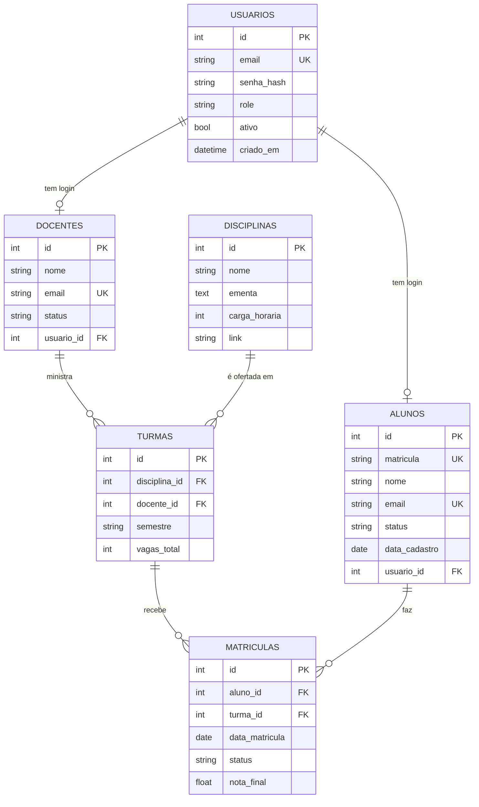

# Modelagem do Banco de Dados

Guia pra modelar o banco em SQLAlchemy usando os dados do professor como base. Essa nota responde "por onde começo a modelagem e o que cada tabela tem".

> [!important] De onde sai esse modelo
> Os JSON do backend de referência do professor (https://github.com/DjanInfo/poswebserver) já têm os dados. A gente não inventa nada — copia o shape de lá e **normaliza** (transforma texto solto em relação de verdade). Contexto completo em [[00 - LEIA PRIMEIRO - Repositórios novos do professor]].

---

## A ideia central: achatado → relacional

O professor guarda tudo em JSON "achatado", sem ligação entre as tabelas. Exemplo: no `docentes.json`, a disciplina do docente é um **texto** ("Programação para web I"), não um ID. Se a disciplina mudar de nome, quebra.

Nosso trabalho com SQLAlchemy é **normalizar**: cada coisa vira uma tabela, e as ligações viram **chave estrangeira (FK)**. É literalmente o valor que a gente agrega por cima do sistema dele.

| No JSON do professor | No nosso banco relacional |
|---|---|
| `docentes.disciplina = "Prog Web I"` (texto) | `turmas.disciplina_id → disciplinas.id` (FK) |
| `usuarios` e `alunos` soltos | `alunos.usuario_id → usuarios.id` (FK) |
| senha em texto puro | `senha_hash` (bcrypt) |
| sem turmas nem matrículas | tabelas novas que a gente cria |

---

## Como os dados do professor estão hoje

Olhei cada JSON. É isto:

```
usuarios     → id · login(guarda o nome) · senha(texto puro) · perfil
alunos       → matricula · nome · email · status · data
docentes     → id · nome · email · status · disciplina(texto)
disciplinas  → id · nome · ementa · ch(carga horária) · link(pdf)
inscricoes   → id · nome · email · status · data
```

(ele tem ainda noticias, editais, artigos, ouvidorias, documentos — fora do escopo do nosso Trello por enquanto)

---

## O modelo que a gente vai construir



---

## Tabela por tabela (detalhe + de onde veio)

### usuarios — login (RF001)

| Campo | Tipo | Regra | Veio de |
|---|---|---|---|
| id | int | PK, auto | — |
| email | varchar(255) | único, obrigatório | novo (o prof não separava) |
| senha_hash | varchar(255) | obrigatório | era `senha` (texto puro) → vira hash |
| role | varchar(20) | obrigatório | era `perfil` ("Estudante") |
| ativo | boolean | default true | novo |
| criado_em | timestamp | default agora | novo |

`role` aceita: `estudante`, `docente`, `admin`. É o valor que vai dentro do JWT.

### alunos — RF002

| Campo | Tipo | Regra | Veio de |
|---|---|---|---|
| id | int | PK, auto | — |
| matricula | varchar(20) | único | `matricula` |
| nome | varchar(255) | obrigatório | `nome` |
| email | varchar(255) | único | `email` |
| status | varchar(20) | default "Ativo" | `status` |
| data_cadastro | date | — | `data` (era "12/02/2026") |
| usuario_id | int | FK → usuarios.id, nullable | novo (liga ao login) |

### docentes — RF003

| Campo | Tipo | Regra | Veio de |
|---|---|---|---|
| id | int | PK, auto | `id` |
| nome | varchar(255) | obrigatório | `nome` |
| email | varchar(255) | único | `email` |
| status | varchar(20) | default "Ativo" | `status` |
| usuario_id | int | FK → usuarios.id, nullable | novo |

> [!note] O campo `disciplina` do professor
> No JSON dele o docente tem um campo `disciplina` (texto). A gente **não copia** esse campo aqui — a ligação docente↔disciplina passa a ser feita pela tabela `turmas` (um docente dá uma disciplina num semestre = uma turma). Fica mais correto e flexível.

### disciplinas — RF004

| Campo | Tipo | Regra | Veio de |
|---|---|---|---|
| id | int | PK, auto | `id` |
| nome | varchar(255) | obrigatório | `nome` |
| ementa | text | — | `ementa` |
| carga_horaria | int | — | `ch` (era "40") |
| link | varchar(255) | nullable | `link` (pdf da ementa) |

### turmas — RF005 (não existe no professor, a gente cria)

| Campo | Tipo | Regra |
|---|---|---|
| id | int | PK, auto |
| disciplina_id | int | FK → disciplinas.id |
| docente_id | int | FK → docentes.id |
| semestre | varchar(10) | ex: "2026.1" |
| vagas_total | int | — |

### matriculas — RF006 (não existe no professor, a gente cria)

| Campo | Tipo | Regra |
|---|---|---|
| id | int | PK, auto |
| aluno_id | int | FK → alunos.id |
| turma_id | int | FK → turmas.id |
| data_matricula | date | default hoje |
| status | varchar(20) | ativa/trancada/concluida |
| nota_final | float | nullable |

> [!tip] Aluno ↔ Turma é "muitos pra muitos"
> Um aluno faz várias turmas, uma turma tem vários alunos. A tabela `matriculas` é o meio do caminho (tabela associativa) que resolve isso — e ainda guarda dados próprios da matrícula (nota, status).

---

## Decisões de modelagem (pra não travar discutindo)

**1. Por que `usuarios` separado de `alunos`/`docentes`?**
`usuarios` é só credencial de login (email + senha + role). `alunos` e `docentes` são os dados acadêmicos. Uma pessoa que é aluno tem 1 login (`usuario`) + 1 registro de aluno, ligados por FK. Isso espelha o professor (que tem `usuarios.json` E `alunos.json` separados) e mantém o login limpo.

**2. Por que ligar docente↔disciplina via `turmas` e não direto?**
Porque o mesmo docente pode dar disciplinas diferentes em semestres diferentes. Colocar `disciplina_id` direto no docente trava isso. A `turma` resolve: ela diz "docente X dá disciplina Y no semestre Z".

**3. Guardar `vagas_disponiveis` ou calcular?**
Recomendo **calcular** (`vagas_total - nº de matrículas ativas`) em vez de guardar um campo que precisa ficar atualizando. Menos chance de bug.

**4. `matricula` do aluno é o PK?**
Não. Usa um `id` interno auto-incremento como PK e deixa `matricula` como campo único. Mais seguro pra FKs.

---

## ForeignKey vs relationship (a dúvida que sempre aparece)

Nos models aparecem **duas coisas** que ligam tabelas, e elas são diferentes:

### ForeignKey — a ligação REAL no banco (é uma coluna)
```python
usuario_id = Column(Integer, ForeignKey("usuarios.id"))
```
- É uma **coluna de verdade** na tabela. Guarda um **número** (o id da outra tabela).
- É o que o **banco** usa pra saber qual linha está ligada a qual.
- Ex: `docentes.usuario_id = 5` → esse docente está ligado ao usuario de id 5.

### relationship — a NAVEGAÇÃO no Python (NÃO é coluna)
```python
turmas = relationship("Turma", back_populates="docente")
```
- **Não é uma coluna.** Não existe no banco. É só uma conveniência do **SQLAlchemy** (Python).
- Deixa você **navegar** entre os objetos sem escrever SQL.
- Ex: `docente.turmas` → te dá a **lista de objetos Turma** daquele docente, automaticamente.

### A diferença na prática
- **Sem** a relationship, pra pegar as turmas de um docente você escreveria uma query:
  `db.query(Turma).filter(Turma.docente_id == docente.id).all()`
- **Com** a relationship, você só faz: `docente.turmas` — o SQLAlchemy faz a query por baixo.

### back_populates — liga os dois lados
```python
# no Docente:
turmas = relationship("Turma", back_populates="docente")
# na Turma:
docente = relationship("Docente", back_populates="turmas")
```
Cria a navegação nos **dois sentidos**: `docente.turmas` (as turmas do docente) E `turma.docente` (o docente da turma). O `back_populates` diz "esses dois são o mesmo vínculo, mantém sincronizados".

### Resumo

| | ForeignKey | relationship |
|---|---|---|
| É coluna no banco? | SIM | NÃO |
| Aparece na migration? | SIM | NÃO |
| Pra que serve | guardar o vínculo (o número) | navegar entre objetos no Python |
| Exemplo | `docente.usuario_id = 5` | `docente.turmas` → [Turma, Turma...] |

> [!note] Por isso a relationship não entra na migration
> Quando você adicionou `cpf` e `titulacao` (colunas), a migration teve elas. Mas a linha `turmas = relationship(...)` **não vira coluna** nem entra na migration — é só Python. A ligação real no banco é a **ForeignKey** (`docente_id` lá na tabela turmas).

---

## Os models em SQLAlchemy

> [!important] Caminhos no repo do Hiago
> Os arquivos vão em **`back/models/`** (não `app/models/`) e o import do Base é **`from db.database import Base`** (o Hiago já deixou o `Base` pronto lá). O arquivo `back/models/user_model.py` já existe vazio — é onde o `Usuario` entra. Segue a convenção dele de sufixo `_model.py`.

Exemplo dos principais (já com os caminhos certos):

```python
# back/models/user_model.py
from sqlalchemy import Column, Integer, String, Boolean, DateTime
from sqlalchemy.sql import func
from db.database import Base

class Usuario(Base):
    __tablename__ = "usuarios"

    id = Column(Integer, primary_key=True, index=True)
    email = Column(String(255), unique=True, nullable=False, index=True)
    senha_hash = Column(String(255), nullable=False)
    role = Column(String(20), nullable=False)  # estudante | docente | admin
    ativo = Column(Boolean, default=True)
    criado_em = Column(DateTime, server_default=func.now())
```

```python
# back/models/aluno_model.py
from sqlalchemy import Column, Integer, String, Date, ForeignKey
from sqlalchemy.orm import relationship
from db.database import Base

class Aluno(Base):
    __tablename__ = "alunos"

    id = Column(Integer, primary_key=True, index=True)
    matricula = Column(String(20), unique=True, nullable=False)
    nome = Column(String(255), nullable=False)
    email = Column(String(255), unique=True, nullable=False)
    status = Column(String(20), default="Ativo")
    data_cadastro = Column(Date)
    usuario_id = Column(Integer, ForeignKey("usuarios.id"), nullable=True)

    matriculas = relationship("Matricula", back_populates="aluno")
```

```python
# back/models/docente_model.py
from sqlalchemy import Column, Integer, String, ForeignKey
from sqlalchemy.orm import relationship
from db.database import Base

class Docente(Base):
    __tablename__ = "docentes"

    id = Column(Integer, primary_key=True, index=True)
    nome = Column(String(255), nullable=False)
    email = Column(String(255), unique=True, nullable=False)
    status = Column(String(20), default="Ativo")
    usuario_id = Column(Integer, ForeignKey("usuarios.id"), nullable=True)

    turmas = relationship("Turma", back_populates="docente")
```

```python
# back/models/disciplina_model.py
from sqlalchemy import Column, Integer, String, Text
from sqlalchemy.orm import relationship
from db.database import Base

class Disciplina(Base):
    __tablename__ = "disciplinas"

    id = Column(Integer, primary_key=True, index=True)
    nome = Column(String(255), nullable=False)
    ementa = Column(Text)
    carga_horaria = Column(Integer)
    link = Column(String(255), nullable=True)

    turmas = relationship("Turma", back_populates="disciplina")
```

```python
# back/models/turma_model.py
from sqlalchemy import Column, Integer, String, ForeignKey
from sqlalchemy.orm import relationship
from db.database import Base

class Turma(Base):
    __tablename__ = "turmas"

    id = Column(Integer, primary_key=True, index=True)
    disciplina_id = Column(Integer, ForeignKey("disciplinas.id"), nullable=False)
    docente_id = Column(Integer, ForeignKey("docentes.id"), nullable=False)
    semestre = Column(String(10), nullable=False)
    vagas_total = Column(Integer, nullable=False)

    disciplina = relationship("Disciplina", back_populates="turmas")
    docente = relationship("Docente", back_populates="turmas")
    matriculas = relationship("Matricula", back_populates="turma")
```

```python
# back/models/matricula_model.py
from sqlalchemy import Column, Integer, String, Date, Float, ForeignKey
from sqlalchemy.orm import relationship
from sqlalchemy.sql import func
from db.database import Base

class Matricula(Base):
    __tablename__ = "matriculas"

    id = Column(Integer, primary_key=True, index=True)
    aluno_id = Column(Integer, ForeignKey("alunos.id"), nullable=False)
    turma_id = Column(Integer, ForeignKey("turmas.id"), nullable=False)
    data_matricula = Column(Date, server_default=func.now())
    status = Column(String(20), default="ativa")
    nota_final = Column(Float, nullable=True)

    aluno = relationship("Aluno", back_populates="matriculas")
    turma = relationship("Turma", back_populates="matriculas")
```

> [!warning] Importar todos os models antes de migrar
> O Alembic (ou o `create_all`) só "enxerga" um model se ele for importado. Cria um `back/models/__init__.py` que importa todos:
> ```python
> from models.user_model import Usuario
> from models.aluno_model import Aluno
> from models.docente_model import Docente
> from models.disciplina_model import Disciplina
> from models.turma_model import Turma
> from models.matricula_model import Matricula
> ```

---

## Passo a passo da modelagem

Faz nessa ordem. Não tenta fazer tudo de uma vez.

1. **Confere que o ambiente subiu** (`uvicorn app.main:app --reload` funciona) e o banco conecta
2. **Abre os JSON do professor** lado a lado: `usuarios.json`, `alunos.json`, `docentes.json`, `disciplinas.json`
3. **Cria o `Usuario` primeiro** (`app/models/usuario.py`) — ele destrava o RF001
4. **Configura o Alembic:**
   ```bash
   alembic init alembic
   ```
   No `alembic/env.py`, aponta pro Base e pra DATABASE_URL (importa `from models import *` e `from db.database import Base`)
5. **Gera a primeira migration só do Usuario:**
   ```bash
   alembic revision --autogenerate -m "cria tabela usuarios"
   alembic upgrade head
   ```
6. **Confere no DBeaver** que a tabela `usuarios` apareceu no banco
7. **Avisa no grupo** que o Usuario tá pronto → libera quem vai fazer o RF001
8. **Cria os outros models** um por um: Aluno, Docente, Disciplina, depois Turma e Matricula (essa ordem respeita as FKs)
9. **Gera migration de cada bloco** e aplica
10. **Roda o seed** pra ter dados de teste (ver abaixo)
11. **Valida** que dá pra inserir e consultar via Swagger

---

## Seed de dados pra testar

`seed.py` na raiz do backend, populando a partir dos dados do professor:

```python
# back/seed.py
from db.database import SessionLocal
from models.user_model import Usuario
from models.aluno_model import Aluno
from core.security import hash_password

db = SessionLocal()

if not db.query(Usuario).filter_by(email="admin@ifba.edu.br").first():
    db.add(Usuario(email="admin@ifba.edu.br",
                   senha_hash=hash_password("admin123"), role="admin"))

if not db.query(Aluno).filter_by(matricula="2").first():
    db.add(Aluno(matricula="2", nome="Hiago Alves",
                 email="ha@ifba.edu.br", status="Ativo"))

db.commit()
db.close()
print("Seed OK")
```

---

## Ordem de criação por causa das FKs

Tem que respeitar a dependência, senão a FK aponta pra tabela que não existe:

```
1. usuarios       (não depende de ninguém)
2. alunos         (FK → usuarios)
3. docentes       (FK → usuarios)
4. disciplinas    (não depende de ninguém)
5. turmas         (FK → disciplinas, docentes)
6. matriculas     (FK → alunos, turmas)
```

---

## Definição de "pronto" (modelagem)

- [ ] Os 6 models criados em `app/models/`
- [ ] `app/models/__init__.py` importa todos
- [ ] Alembic configurado e migrations aplicadas sem erro
- [ ] As 6 tabelas aparecem no banco (conferir no DBeaver)
- [ ] FKs funcionando (tenta inserir matrícula com aluno_id que não existe → tem que dar erro)
- [ ] Seed roda e popula dados de teste
- [ ] Nenhuma senha em texto puro (sempre `senha_hash`)
- [ ] DER desenhado (dbdiagram.io) e anexado pra documentação

---

## Links

- Backend referência (JSON pra copiar o shape): https://github.com/DjanInfo/poswebserver
- Desenhar o DER online: https://dbdiagram.io
- SQLAlchemy 2 ORM: https://docs.sqlalchemy.org/en/20/orm/
- Alembic: https://alembic.sqlalchemy.org/en/latest/tutorial.html
- Notas: [[00 - LEIA PRIMEIRO - Repositórios novos do professor]] · [[Como começar - Sprint 1]] · [[RF001 - Login com JWT]]
